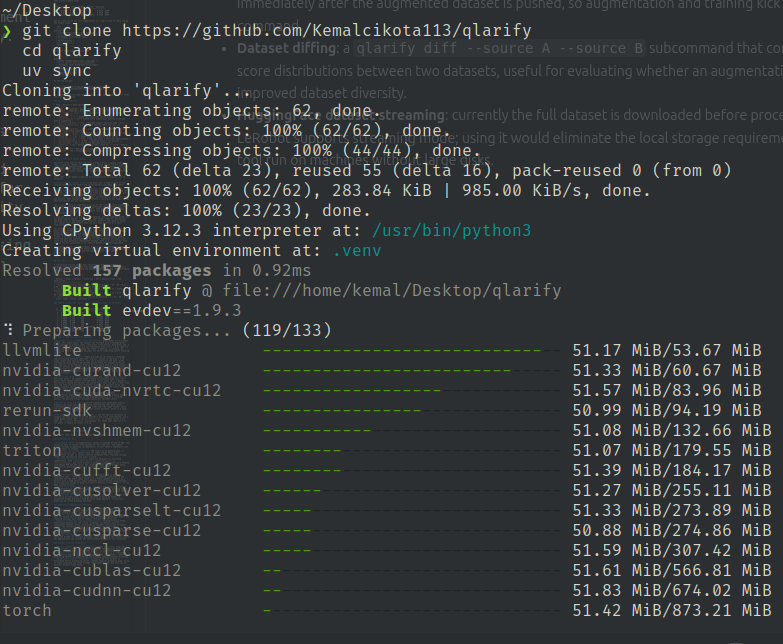
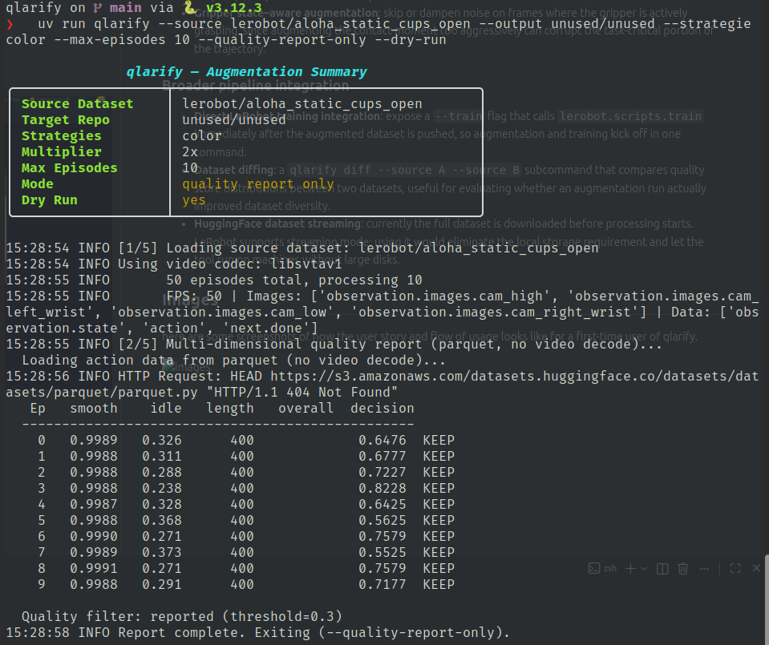
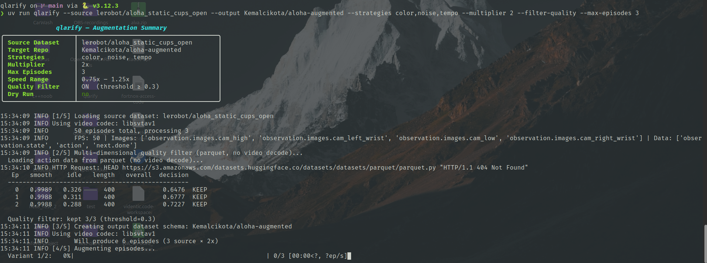
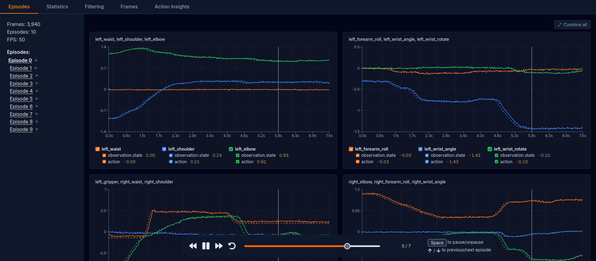
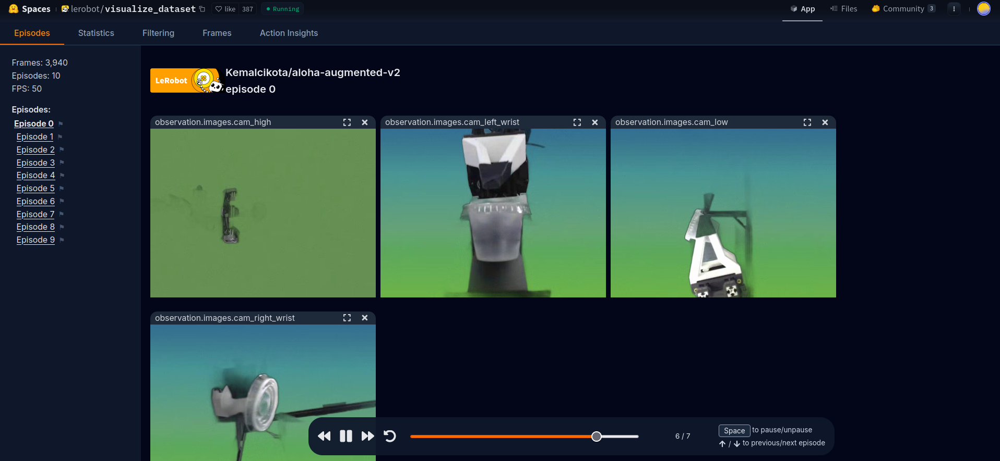
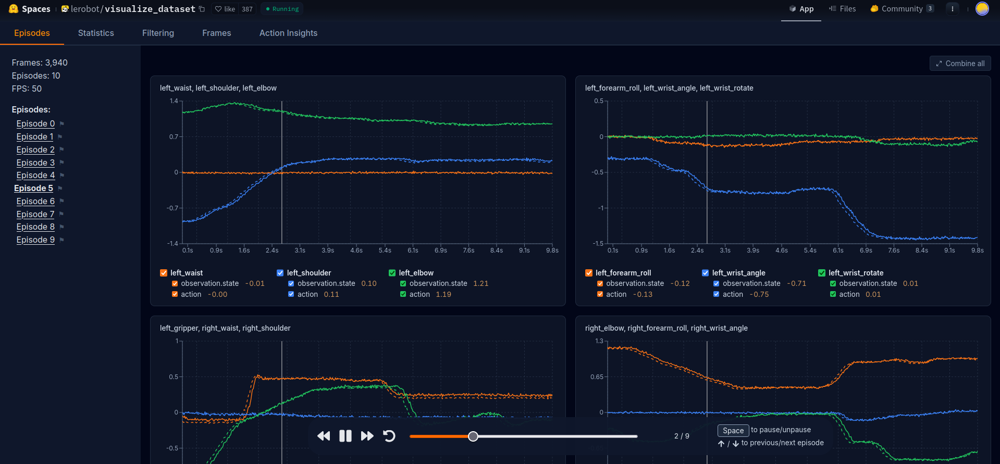
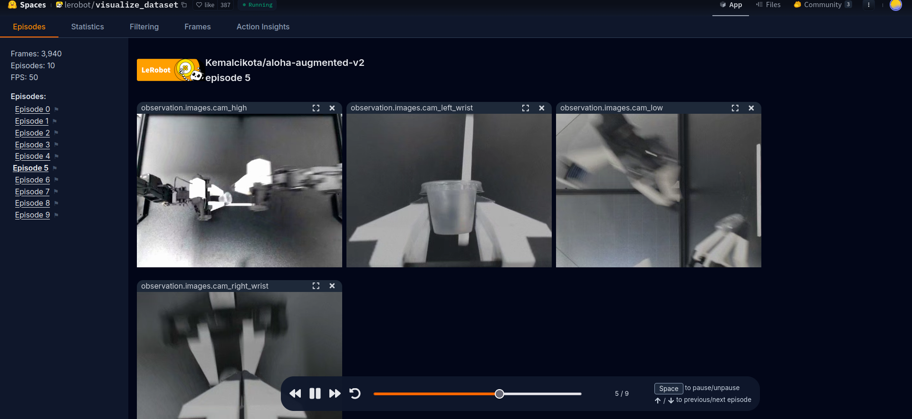

# Qlarify - A LeRobot Dataset Augmentation Tool

Qlarify is a CLI tool that downloads a [LeRobot v3](https://huggingface.co/docs/lerobot/lerobot-dataset-v3) dataset from HuggingFace Hub, runs it through a multi-strategy augmentation pipeline, and pushes the result back to the Hub, ready to improve policy robustness on real hardware. It was built as part of a 6-hour coding challenge, with the goal of producing something that an ML engineer could actually drop into their workflow, not just a demo.

**Live example:** [Kemalcikota/aloha-augmented-v2](https://huggingface.co/datasets/Kemalcikota/aloha-augmented-v2), view in the [LeRobot Visualizer](https://huggingface.co/spaces/lerobot/visualize_dataset?path=%2FKemalcikota%2Faloha-augmented-v2%2Fepisode_0)

---

## What have I built?

Qlarify applies four independent augmentation strategies to any LeRobot v3 dataset. Each one targets a specific failure mode that shows up when deploying visuomotor policies on real hardware.

### `color` - Photometric Domain Randomization
Applies random ColorJitter (brightness, contrast, saturation, hue) plus Gaussian pixel noise to every camera frame. The goal is to force the policy to stop relying on absolute lighting conditions, a common cause of policies that work perfectly in the lab and fall apart in a slightly different room or under different lights.

### `background` - Spatial Domain Randomization
Uses [rembg](https://github.com/danielgatis/rembg) (a U-Net model) to cut the robot out of each frame and composite it onto a synthetically generated background, either a random solid color or a procedural vertical gradient. Policies trained on a fixed background will learn to use that background as a cue. Replacing it at training time breaks that dependency.

### `tempo` - Temporal Domain Randomization
Resamples each episode's frame sequence at a randomly drawn speed factor (0.75× - 1.25×). Faster variants skip frames; slower ones repeat them. Because `dataset[idx]` returns video frame and kinematics as one atomic dict, skipping a frame index automatically skips both, there is no separate alignment step needed. This teaches the policy to be robust to motor latency, control loop frequency variance, and real-time inference jitter.

### `noise` - Proprioceptive Perturbation
Injects calibrated Gaussian noise into joint state observations (σ=0.01) and action sequences (σ = 0.005). Simulates encoder noise and positional uncertainty without compromising task validity.

### Quality Filtering
Before augmenting, Qlarify can score every source episode across three axes — reading parquet action data directly, no video decode needed:

- **Kinematic smoothness** - jerk (2nd derivative of actions). Low jerk = purposeful motion. Score: `1 / (1 + mean_abs_jerk)`
- **Idle detection** - fraction of frames where mean joint velocity is near zero. Episodes where the robot sits still for >15% of the recording get penalized.
- **Length outlier flag** - episodes ±2σ from the dataset mean length are flagged. This is informational and doesn't auto-drop anything.

The combined score filters out bad demonstrations before they get multiplied across the augmented dataset.

---

## Why did I build it?

I wanted to put the needs of a potential ML/AI engineer at Qualia first. Qualia Studios is working on creating interfaces to train VLA models, systems that take camera observations, a language instruction, and output motor commands. That's a hard problem that requires a lot of high-quality demonstration data. Collecting that data is slow: getting a physical robot to perform a task correctly, recording it, and doing it again dozens or hundreds of times takes real human labor and machine time.

The engineers working on this are deep in the training infrastructure, they're thinking about compute scheduling, data pipelines, model architecture, hardware reliability. The last thing they need is a tool that adds friction. So the design principle here was: **build something that feels like a proper engineering tool, not a research notebook**.

In order to create that kind of tool with the level of reliability needed, i needed to adhere to some of the ML-training principles that i have learned from courses and from other projects i have been working on that i also applied to my tool.

1. **Idempotency** - If you run Qlarify twice with the same output name, it detects the stale local cache and raises a clear error with instructions, rather than crashing with a cryptic `FileExistsError` buried in a stack trace. The `--overwrite` flag lets you explicitly clear it and start fresh.

2. **`try/finally` around `finalize()`** - LeRobot v3 requires `finalize()` to be called before `push_to_hub()`, otherwise parquet file footers are never written and the remote dataset silently corrupts. If augmentation fails halfway through an episode, `finalize()` still runs. This is not a nice-to-have, a corrupted dataset upload on a multi-hour job is an expensive mistake.

3. **`logging` over `print()`** - Every status message goes through Python's `logging` module with timestamps. On a long job running in a container or behind `nohup`, you want a log file you can inspect after the fact, not output that disappears.

4. **Type hints throughout** - All function signatures are fully annotated. On a team codebase where engineers might not be the original author of a piece of code, type hints are the difference between a function that's easy to integrate and one that requires reading the implementation before you can call it.

5. **O(1) memory streaming** - The first version of the pipeline pre-loaded all frames before augmenting. 400 frames × 4 cameras × 480×640 × float32 is about 5.5 GB per episode. The current design processes one frame at a time. Memory usage is constant regardless of dataset size.

These aren't flashy features. But on a training run that costs real compute, saving a single wasted job, because the output was corrupted, or the process OOM-killed, or the logs were unreadable, is worth more than an extra augmentation strategy.

---

## How did I build it? What was my thought process?

The first hour was spent reading, LeRobot v3 documentation, the library source, how the dataset format actually works at the parquet/video level. I'm not an ML researcher, so I wasn't going to out-paper anyone on augmentation theory. The bet I made was that the engineering quality of the tool would matter more than whether I implemented the latest technique from a 2024 ICLR submission.

**Architecture first.** The core decision was to build a streaming CLI that mirrors the source dataset's schema automatically. `create_output_dataset()` reads `fps`, `features`, and `robot_type` directly from the source, so the same binary runs against ALOHA (14-DOF, 4 cameras, 50fps), PushT (2-DOF, 1 camera, 10fps), xArm (4-DOF, 1 camera), and Unitree H1 (19-DOF humanoid) with zero code changes. I dry-run validated all four during development.

**CLI as the interface.** Everything is exposed as flags, strategies, multiplier, quality threshold, background style, speed range, noise scale. There's no config file to edit, no Python API to import. You pull the Docker image and run it. The `--dry-run` flag processes everything locally and skips the upload, which is how every iteration was tested before touching the Hub.

**Packaging for real use.** `pyproject.toml` + `uv.lock` means the dependency resolution is frozen and reproducible. The multi-stage Dockerfile bakes dependencies in the build stage (so they're cached separately from source changes) and produces a slim runtime image with only what's needed: the venv, `ffmpeg`, and the OpenCV system deps. The container acts as a CLI tool directly, `docker run qlarify --source ... --output ...`.

The quality scoring module is probably the piece I'm most satisfied with. Scoring 100 episodes by reading only the parquet action columns — no video, no `dataset[i]` calls, runs in a few seconds. Doing the same thing by iterating frames would take minutes. It's the kind of optimization that doesn't show up in a demo but matters when you're running this regularly as part of a data pipeline.

---

## How do you run it?

### Option A — Docker (recommended)

```bash
git clone https://github.com/Kemalcikota113/qlarify
cd qlarify

# Build the image (first time ~5 min, cached after)
docker build -t qlarify .

# Set your HuggingFace write token
export HF_TOKEN=hf_...

# Smoke test — quality report on 5 episodes, no upload
docker run --rm \
  -e HF_TOKEN=$HF_TOKEN \
  qlarify \
    --source lerobot/aloha_static_cups_open \
    --output unused/unused \
    --strategies color \
    --max-episodes 5 \
    --quality-report-only \
    --dry-run
```

### Option B — uv

```bash
git clone https://github.com/Kemalcikota113/qlarify
cd qlarify
uv sync                        # installs exact versions from uv.lock
export HF_TOKEN=hf_...
uv run qlarify --help
```

### Option C — pip

```bash
git clone https://github.com/Kemalcikota113/qlarify
cd qlarify
python -m venv venv && source venv/bin/activate
pip install -e .
export HF_TOKEN=hf_...
qlarify --help
```

---

## How do you use it?

### A complete walkthrough

Start by inspecting the source data before touching anything:

> **Prerequisite:** a HuggingFace write token must be set before any run that uploads.
> ```bash
> export HF_TOKEN=hf_your_token_here   # get one at https://huggingface.co/settings/tokens
> ```
> The token only needs to be set once per shell session. Use `--dry-run` to skip the upload entirely if you just want to test locally.

```bash
# Step 1 — check episode quality before augmenting (fast, no video decode)
qlarify \
  --source lerobot/aloha_static_cups_open \
  --output unused/unused \
  --strategies color \
  --max-episodes 20 \
  --quality-report-only \
  --dry-run
```

This prints a table like:

```
  Ep   smooth    idle   length   overall  decision
  -------------------------------------------------
   0   0.9989   0.326      400             0.6476  KEEP
   3   0.9988   0.238      400             0.8228  KEEP
   7   0.9989   0.373      400 [OUTLIER]   0.5525  DROP
```

Now do a dry run of the full augmentation on a small slice to check timing and output shape:

```bash
# Step 2 — dry run, no upload
qlarify \
  --source lerobot/aloha_static_cups_open \
  --output your-hf-user/aloha-augmented-test \
  --strategies color,noise,tempo \
  --multiplier 2 \
  --filter-quality \
  --max-episodes 3 \
  --dry-run
```

Once that looks right, run for real:

```bash
# Step 3 — full run with upload
qlarify \
  --source lerobot/aloha_static_cups_open \
  --output your-hf-user/aloha-augmented \
  --strategies color,background,noise,tempo \
  --multiplier 3 \
  --filter-quality \
  --quality-threshold 0.3 \
  --background-episodes 2 \
  --max-episodes 5
```

At the end you get:

```
https://huggingface.co/spaces/lerobot/visualize_dataset?path=%2Fyour-hf-user%2Faloha-augmented%2Fepisode_0
```

If you need to re-run with the same output name, add `--overwrite` to clear the stale local cache.

### Full flag reference

| Flag | Default | Description |
|---|---|---|
| `--source` | required | Source LeRobot v3 dataset on HuggingFace Hub |
| `--output` | required | Output repo ID (`user/dataset-name`) |
| `--strategies` | `color` | Comma-separated: `color`, `background`, `noise`, `tempo` |
| `--multiplier` | `2` | Augmented copies per source episode |
| `--filter-quality` | off | Enable multi-dimensional quality filtering before augmenting |
| `--quality-threshold` | `0.3` | Minimum overall score to keep `[0,1]` |
| `--quality-report-only` | off | Print quality table and exit, no augmentation |
| `--background-episodes` | all | Limit background replacement to first N episodes (caps rembg compute) |
| `--bg-style` | `random` | Background type: `solid`, `gradient`, `random` |
| `--speed-min` | `0.75` | Lower bound for temporal speed factor |
| `--speed-max` | `1.25` | Upper bound for temporal speed factor |
| `--state-noise-scale` | `0.01` | Gaussian noise σ for state observations |
| `--action-noise-scale` | `0.005` | Gaussian noise σ for actions |
| `--max-episodes` | all | Cap source episodes processed |
| `--overwrite` | off | Delete existing local cache for `--output` before starting |
| `--private` | off | Upload as private dataset |
| `--dry-run` | off | Process locally, skip upload |

---

## How I work with coding agents

The first solid hour of this challenge I didn't write a single line of code. I read the LeRobot v3 documentation, looked at the library source, understood the dataset format, and figured out what the actual constraints were: memory, API contracts, what `add_frame()` actually expects vs. what `dataset[i]` actually returns. That groundwork mattered more than starting fast.

After that, I use agents primarily as a productivity multiplier, not an autopilot.

**Claude Code CLI (Sonnet 4.6)** is my main tool. I keep it open in the terminal alongside the editor and switch between two modes constantly:

- **Plan mode**: for architecture decisions, before writing anything. I'll describe the problem and the constraints and ask it to reason through the tradeoffs. This is where the streaming frame architecture came from, and where it caught the 5.5 GB OOM risk before I ran into it.
- **Edit mode**: for implementation. Once the approach is clear, it's fast and precise. Type annotation passes, refactors, wiring up new flags, things that are tedious but not interesting.

The `.claude/` file is something I set up at the start of every project and keep updated throughout. It acts as a persistent shared context, the API facts I've discovered, what's been built, what direction we're heading. Without it, the agent starts each session cold and you spend cycles re-explaining things it already knew.

I also use **Gemini** as a fast second opinion, not for implementation, but for quick sanity checks. "Is this the right mental model for how parquet sharding works in the HuggingFace datasets library?" That kind of thing. It's faster than reading docs when you just need a yes/no or a short clarification.

For parallel workstreams, I use **OpenSwarm**, a Git worktree editor I built with a friend. It lets me run multiple Claude or OpenCode instances across separate worktrees simultaneously. If I need to explore two different approaches to the same problem at once without blocking on either, I'll split them out. On this challenge it mostly wasn't needed since the work was sequential, but it's a real timesaver on larger tasks where you have genuinely independent threads. here is a link to that tool in case you are interested in it: https://github.com/Matars/OpenSwarm/

The honest summary: I used AI agents heavily for implementation speed and for surfacing non-obvious API details I would have had to dig out manually. The architectural decisions and the judgment calls about what to prioritize, that was me.

---

## The results I got

I ran quality scoring across four structurally different LeRobot v3 datasets to validate that the tool generalises and that the scores carry real signal. All runs were dry-run validated with zero code changes between datasets.

### Quality scores by dataset

| Dataset | Robot | Cameras | State dim | FPS | Quality range | Key observation |
|---|---|---|---|---|---|---|
| `lerobot/aloha_static_cups_open` | ALOHA dual-arm | 4 | 14 | 50 | 0.41 - 0.83 | Wide spread - mix of clean and hesitant demos |
| `lerobot/pusht` | 2D sim pusher | 1 | 2 | 10 | 0.30 - 0.32 | Tight cluster, all low — expected for contact tasks |
| `lerobot/xarm_lift_medium` | xArm robotic arm | 1 | 4 | 15 | 0.37 - 0.50 | Idle ratio = 0.000 on all episodes |
| `lerobot/unitreeh1_warehouse` | Unitree H1 humanoid | 2 | 19 | 50 | 0.47 - 0.55 | Tight cluster, mid-range |

### Sample per-episode report (aloha_static_cups_open, 10 episodes)

```
  Ep   smooth    idle   length   overall  decision
  -------------------------------------------------
   0   0.9989   0.326      400             0.6476  KEEP
   1   0.9988   0.213      400             0.8384  KEEP
   2   0.9987   0.280      400             0.7454  KEEP
   3   0.9988   0.238      400             0.8228  KEEP
   4   0.9989   0.319      400             0.6616  KEEP
   5   0.9986   0.290      400             0.7254  KEEP
   6   0.9987   0.421      400             0.4374  KEEP
   7   0.9989   0.373      400 [OUTLIER]   0.5525  KEEP
   8   0.9988   0.244      400             0.8108  KEEP
   9   0.9989   0.251      400             0.7968  KEEP
```

### How to read this as an ML engineer

**Smoothness scores (0.998x across the board)**: ALOHA demos are extremely smooth. This makes sense: the dataset was recorded with a teleoperation setup designed to produce clean, continuous trajectories. Smoothness near 1.0 means negligible jerk. If you saw smoothness drop to 0.7 - 0.8, that's a signal the operator was fighting the robot, trembling, correcting, or recovering from a slip. Those episodes are worth inspecting before training on them.

**Idle ratios (0.21 – 0.42)**: These are high by the metric's standards, and the scoring reflects that with `overall` scores in the 0.44 - 0.84 range rather than near-perfect. This isn't necessarily bad data, ALOHA cup-opening tasks involve deliberate pauses while the gripper positions over the cup. An ML engineer looking at this would want to check whether the idle periods are concentrated at the start/end (setup motion, which is usually fine) or scattered throughout (which might indicate hesitation or failed grasps). The quality filter at threshold 0.3 keeps all of these, which is correct.

**pusht scores (0.30 – 0.32)**: Consistently low, tight cluster. This is the right answer. 2D contact tasks produce structurally high jerk, the pusher makes sudden contact with the block, which shows up as a spike in the action's second derivative. The scores don't mean the data is bad; they mean the task has a different kinematic profile. An engineer using this across datasets should calibrate the threshold per dataset rather than using a single global cutoff.

**xArm idle ratio = 0.000**: This is scripted data, not human teleoperation. Algorithmic trajectories don't pause; they execute exactly as planned. Zero idle frames is the expected signature of a scripted policy. The quality filter correctly leaves all episodes intact.

**Unitree H1 (0.47 – 0.55)**: A 19-DOF humanoid with whole-body control produces mid-range jerk scores because coordinating that many joints simultaneously is just noisier than a 4-DOF arm. The tight cluster tells you the recording quality is consistent across episodes, which is a good sign for training stability.

**The action an engineer takes from this:** set the quality threshold at roughly the 20th percentile of the dataset's own score distribution, not a fixed global value. Use `--quality-report-only` to inspect scores first, then set `--quality-threshold` accordingly. For ALOHA that might be 0.5; for pusht it should be closer to 0.25.

---

## How I would further develop this

Given more time, here's where I'd take this, roughly in priority order.

### Immediate QoL wins

- **Resumable runs**: if augmentation crashes at episode 47 out of 200, you should be able to restart from episode 47, not from zero. The output dataset already accumulates incrementally; it just needs a checkpoint file to know where it stopped.
- **YAML/TOML config file support**: the flag list is getting long. A `--config qlarify.yaml` option would let teams commit their exact augmentation recipes to version control alongside their training configs, rather than maintaining long shell scripts.
- **Parallel episode processing**: right now episodes are processed sequentially. With `concurrent.futures.ThreadPoolExecutor` or `multiprocessing`, you could process N episodes simultaneously on a machine with enough RAM and CPU cores. The streaming frame design already makes this safe in principle since each episode is independent.

### Performance

- **CUDA-accelerated background removal**: rembg on CPU is the main bottleneck when `--strategies background` is enabled. Switching to GPU inference for the U2Net model would give a 5–10× speedup per frame on a machine with a CUDA device, which compounds quickly across large datasets. It's a one-line change to pass `providers=["CUDAExecutionProvider"]` to the ONNX runtime session.
- **Batch frame inference for rembg**: currently each frame goes through rembg individually. The model supports batched inference; grouping frames from multiple cameras or episodes into a single forward pass would improve GPU utilisation significantly.
- **VideoWriter for direct output**: LeRobot's `add_frame()` encodes video internally on every call. For large episodes it would be faster to accumulate frames and write them directly using OpenCV's `VideoWriter`, bypassing per-frame encoding overhead.

### Additional augmentation strategies

- **Camera perspective jitter**: small random affine transforms (translation ±5%, rotation ±3°) to simulate camera mounting variance between hardware setups. Cheap to implement with torchvision.
- **Episode splicing / mixup**: concatenate the first half of one episode with the second half of another to create synthetic transitions. Useful for training policies that need to recover from mid-task deviations.
- **Optical flow–guided temporal augmentation**: instead of naive frame repetition/skipping for the `tempo` strategy, use optical flow to interpolate between frames. This produces smoother slow-motion variants without the stuttering artifact that comes from repeated frames.
- **Depth noise**: for datasets with depth cameras, inject structured noise (salt-and-pepper, simulated sensor dropout) to replicate real-world depth sensor behaviour.
- **Gripper state–aware augmentation**: skip or dampen noise on frames where the gripper is actively grasping, since augmenting the contact moment too aggressively can corrupt the task-critical portion of the trajectory.

### Broader pipeline integration

- **Direct LeRobot training integration**: expose a `--train` flag that calls `lerobot.scripts.train` immediately after the augmented dataset is pushed, so augmentation and training kick off in one command.
- **Dataset diffing**: a `qlarify diff --source A --source B` subcommand that compares quality score distributions between two datasets, useful for evaluating whether an augmentation run actually improved dataset diversity.
- **HuggingFace dataset streaming**: currently the full dataset is downloaded before processing starts. LeRobot supports streaming mode; using it would eliminate the local storage requirement and let the tool run on machines without large disks.

## Screenshots

Here is the full user story flow from clone to visualizer, as a first-time user would experience it.

**1. Installing and cloning the repo**

`git clone` + `uv sync` - dependencies resolve from the frozen lock file in under two minutes.

**2. Running the quality report**

The rich summary table prints immediately, followed by the per-episode quality report, smoothness, idle ratio, and overall score for each episode, no video decode needed.

**3. Full augmentation pipeline running**

The complete `[1/5]` through `[4/5]` pipeline: source loaded, quality filter applied, output schema created, episodes augmented with tqdm progress bars, and upload kicked off.

**4. Augmented dataset in the LeRobot Visualizer — action graphs**

Episode 0 joint state and action traces in the HuggingFace visualizer. The smooth curves confirm kinematic integrity is preserved after color + noise + tempo augmentation.

**5. Augmented dataset — spatial domain randomization visible**

All four camera streams for an episode where background replacement was applied. The robot arm is cleanly composited onto a solid green background, the rembg U2Net segmentation working correctly on real hardware footage.

**6. Augmented dataset — action graphs, later episode**

A different episode's state/action traces. The action profiles are structurally similar to the originals but offset by noise injection, the perturbation is present but small enough to preserve task validity.

**7. Augmented dataset — dark background variant**

Episode 5 with a different synthetic background. Comparing this with screenshot 5 shows the background diversity across episodes, solid colors varying per episode, which is the intended behaviour of spatial domain randomization.


